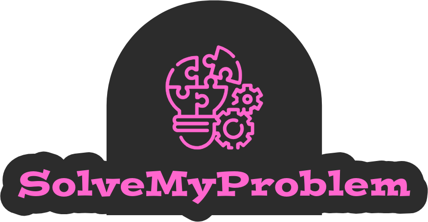

# NTUA ECE SAAS 2024 PROJECT SolveMyProblem
SolveMyProblem solves hard algorithmic problems, using efficient algorithms based on the OR Tools library.
Currently the system supports routing, graph flow and scheduling problems. Its multi-threaded architecture allows it to handle multiple problems simultaneously.
As a SolveMyProblem user, you can:
👉 Submit new problems to be solved.
👉 View all your previous problems, along with their solutions presented in a eye-pleasing, dark themed UI.
👉 View various statistics about the submitted problems, through comprehensive graphs.

To submit a new problem, you can choose between filling a form and uploading a json file (although the json file method is highly encouraged).
The solution values of the problem are presented through the UI and can be downloaded in a json format.

## TEAM (40)
| Name | Α.Μ. |
| --- | --- |
| Michael Raftopoulos | 03120114 |
| Nick Oikonomou | 03120014 |
| Tereza Vassiliou | 03120403 |

### Run the web app:
To run the app you need to:
- Make sure your local mysql server is down: `systemctl stop mysql`
- Start docker server: `systemctl start docker`
- Run `sudo docker compose up  --build `
- The application should automatically launch on your default browser
- If not, visit the frontend address that appears on your terminal (each time you launch the app, a different address is assigned)

### Input files
You can find templates for the input files in the *json_templates* directory.
For input file examples, you can go to *testing/input_files*.

## Documentation
You can view all UML diagrams and the vpp file, along with the microservices description in the *architecture* directory.

### Stress tests
To perform a stress test, run `jmeter -n -t SolveMyProblem.jmx` within the *jmeter* container.
All test result appear in *testing/results* directory, in the form of csv files.
You may also execute `python testing/plot_results.py` to generate a plot from the csv file results.